# PET SHOP MIAU - Documentação do Negócio
## 1. APRESENTAÇÃO: EMPRESA, MERCADO, PROCESSOS E SISTEMAS
### 1.1. Apresentação da Empresa
O **Pet Shop Miau** é um negócio localizado em **Contagem/MG**. A empresa atua principalmente no setor de serviços para animais domésticos, oferecendo **banho e tosa** em diferentes modalidades para cães e gatos.
O petshop é uma **microempresa (MEI)** que presta serviços especializados de higiene e estética animal. Com uma média de **200 a 250 atendimentos mensais**. Em dezembro a empresa alcança o seu maior pico de atendimentos, uma média de **320 atendimentos**. A empresa consolidou sua atuação no segmento de cuidados pet, destacando-se pelo atendimento personalizado e pela flexibilidade de pacotes semanais ou quinzenais.

#### Estrutura e Pessoal
A estrutura é de uma microempresa com **caráter familiar**. O quadro de funcionários é composto por duas pessoas:
* **Proprietário(a):** Responsável pelas tosas, penteados e rotas de coleta/entrega dos animais.
* **Colaborador(a):** Responsável pelos banhos e apoio no cuidado dos pets.

#### Gestão e Controle
A empresa **não utiliza softwares ou sistemas de gestão**, mantendo o controle de agendamentos e pacotes em **agenda e planilhas manuais**. O fechamento mensal é realizado no **Excel**. Os **custos fixos:** envolvem despesas com MEI, folha de pagamento, energia, água, transporte e insumos. Já os **custos variáveis** incluem manutenções, materiais de higiene, acessórios para animais e insumos de rotina.
A escolha do Pet Shop Miau se justifica por ser um exemplo representativo de microempreendimento no setor de serviços, com características típicas de pequenos negócios brasileiros: gestão manual de processos, estrutura familiar, proximidade com os clientes e desafios de organização financeira. Além disso, o estudo da empresa permite analisar práticas de controle administrativo e propor melhorias de gestão.

---
### 1.2. Análise de Mercado
O Pet Shop Miau atua no setor de **serviços pet**, especializado em banho, tosa e cuidados estéticos para cães e gatos. Esse segmento integra o mercado de bem-estar animal, que no Brasil vem apresentando crescimento contínuo, impulsionado pela maior valorização dos tutores em relação à saúde, higiene e estética de seus animais de estimação.
De acordo com a ABINPET (Associação Brasileira da Indústria de Produtos para Animais de Estimação), o mercado pet brasileiro faturou **R$75,4 bilhões em 2024**, representando um aumento de 9,6% em relação ao ano anterior. Além disso, dados da ABINPET e do IBGE apontam que há, em média, **1,8 animal de estimação por residência no Brasil**, reforçando a percepção de que os pets já ocupam papel central nas famílias brasileiras e, consequentemente, impulsionam a demanda por serviços especializados.
Nesse cenário, os pequenos e médios pet shops representam quase metade de todo o movimento do varejo, evidenciando a relevância e a competitividade desse segmento. O Pet Shop Miau se insere de forma estratégica nesse contexto, oferecendo atendimento personalizado e de proximidade, características valorizadas pelos clientes que buscam confiança, qualidade e cuidado individualizado para seus animais.
No mercado local, em Contagem/MG, o petshop **enfrenta concorrência de estabelecimentos de diferentes portes, desde pequenos negócios de bairro até de uma grande franquia** de pet shop que oferece serviços integrados (venda de produtos, atendimento veterinário e estética animal).
As principais práticas do setor incluem:
* Utilização de sistemas digitais de agendamento e cadastro.
* Programas de fidelidade e pacotes promocionais.
* Estratégias de marketing digital (Instagram, WhatsApp Business).
* Estruturas de atendimento diversificadas (hotel, adestramento, clínica).

Comparativamente, o Pet Shop Miau mantém um **atendimento personalizado**, mas ainda opera de forma manual em seus processos de gestão e controle financeiro, o que limita sua competitividade diante de empresas que já adotaram a tecnologia.
A matriz SWOT do Pet Shop Miau permite visualizar o **contexto interno (Forças e Fraquezas)** e **externo (Oportunidades e Ameaças)** do microempreendimento.
Através dos quadrantes elencados abaixo, é possível criar estratégias internas, como:
* Usar forças para aproveitar oportunidades;
* Usar forças para se defender de ameaças;
* Reduzir fraquezas para não perder oportunidades;
* Minimizar fraquezas para enfrentar ameaças.

#### Matriz SWOT do Pet Shop Miau

A análise SWOT visualiza o contexto interno e externo do negócio:

| Forças | Fraquezas |
| :--- | :--- |
| Atendimento personalizado e de confiança. | Falta de sistemas de gestão informatizados. |
| Boa reputação local e proximidade com os clientes. | Controle manual de agenda e finanças, sujeito a erros. |
| Flexibilidade de pacotes semanais/quinzenais. | Dificuldade no acompanhamento de recebimentos e cobranças. |
| Proprietária com experiência prática em estética animal. | Dependência de apenas duas pessoas para todas as funções. |

| Oportunidades | Ameaças |
| :--- | :--- |
| Crescimento do mercado pet e aumento da demanda por serviços especializados. | Concorrência de grandes pet shops e franquias com mais recursos. |
| Adoção de softwares de gestão para otimizar processos. | Clientes inadimplentes ou atrasos nos pagamentos. |
| Possibilidade de expansão de serviços (hotel, produtos, parceria veterinária). | Perda de clientes devido à ausência de marketing digital e divulgação online. |
| Potencial de fidelização por meio de promoções e programas de benefícios. | Aumento nos custos de insumos e manutenção, afetando a margem de lucro. |

O Pet Shop Miau se posiciona como um negócio de **proximidade e confiança**, voltado para clientes que valorizam o cuidado individualizado e o atendimento pessoal. Entretanto, para garantir competitividade no longo prazo, será necessário investir em gestão informatizada, controle financeiro mais estruturado e estratégias de divulgação digital que ampliem sua presença no mercado.

---
### 1.3. Análise de Processos e Sistemas
O Pet Shop Miau apresenta processos operacionais simples e concentrados nos serviços de banho e tosa. Seus principais fluxos podem ser resumidos em:

**a. Agendamento:**
* O cliente agenda o banho/tosa presencialmente, por telefone ou WhatsApp.
* O registro é feito **manualmente em agenda de papel**.
* Pacotes de serviços (semanais ou quinzenais) registrados em **apostila física**.

**b. Coleta e Transporte (quando necessário):**
* A proprietária define rotas de coleta/entrega em Contagem e Betim.
* **Não há sistema de roteirização**; os endereços são memorizados pela equipe.

**c. Execução do Serviço:**
* Banhos e tosas realizados pela equipe.
* Os valores podem variar conforme porte ou necessidades específicas do animal (ex.: quantidade de pelo do animal).

**d. Fechamento Financeiro:**
* Anotações manuais dos serviços prestados.
* Consolidação mensal feita no **Excel, todo dia 13**.
* **Não há integração** entre controle de serviços e controle financeiro.

Para melhor compreensão do funcionamento dos serviços oferecidos pelo Pet Shop Miau, foram elaborados três diagramas que representam de forma simplificada os principais processos de atendimento. O Fluxo de Atendimento (do agendamento ao pagamento) descreve as etapas desde a marcação do serviço até a finalização financeira, assegurando organização e controle das operações. Já o Fluxo de Atendimento (via Pacote) ilustra o processo específico para clientes que optam por pacotes de serviços, detalhando a utilização dos créditos disponíveis. Por fim, o Fluxo de Pacotes Mensais demonstra a gestão e renovação desses pacotes, garantindo praticidade tanto para o cliente quanto para a administração do negócio.

#### Diagramas de Fluxo (Representação Simplificada)

* **Fluxo de atendimento (do agendamento ao pagamento):** 

* **Fluxo de atendimento (via Pacote):**

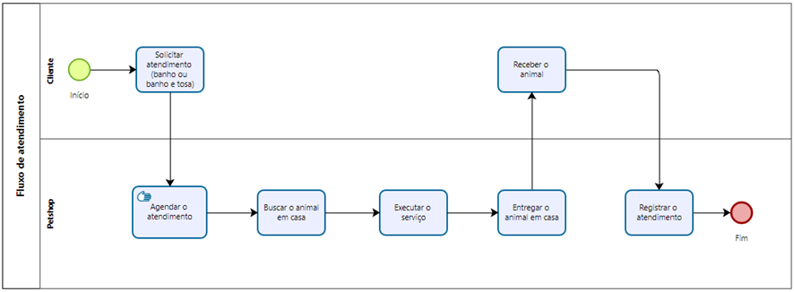

* **Fluxo de pacotes mensais:**

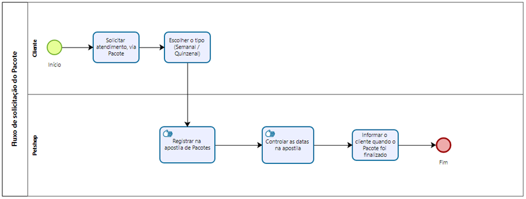

#### Diagnóstico de Sistemas e Tecnologia

Atualmente, o Pet Shop Miau não utiliza nenhum sistema informatizado de gestão. Os controles são **manuais**, com registros em papel e planilhas do Excel.

| Controle | Registro Atual |
| :--- | :--- |
| Dados de Agendamento | Datas, horários e tipos de serviço em papel. |
| Pacotes de Serviços | Registros físicos em apostilas, sem integração digital. |
| Pagamentos e Finanças | Anotações manuais consolidadas mensalmente em planilhas. |

* **Armazenamento:** Físico (papel) e digital básico (Excel).
* **Relatórios:** Não há geração automática de relatórios ou *dashboards*; a análise depende de consolidações manuais mensais.

Foi possível observar as seguintes falhas e dificuldades:
* **Gestão Manual:** Maior risco de perda de informações, erros de cálculo e retrabalho.
* **Ausência de Integração:** Dados de agendamento, serviços e finanças não se conectam.
* **Controle Financeiro Impreciso:** Falta de acompanhamento preciso de receitas e despesas.
* **Cobrança Fragilizada:** Dificuldade em identificar pacotes vencidos e pendências.
* **Dependência da Memória:** Rotas de coleta não registradas formalmente.

Quanto às oportunidades de melhoria identificadas:
* Implantação de um **sistema de gestão** que centralize agendamento, cadastro, serviços, pacotes e pagamentos.
* Uso de **agenda digital integrada** (ex: Google Calendar, apps de agendamento) com alertas automáticos.
* **Digitalização** dos cadastros de clientes e pets.
* Implementação de **roteirização digital** de coletas.

Atualmente, o Pet Shop Miau encontra-se em um **nível inicial de maturidade tecnológica**, com sua capacidade de armazenamento limitada a anotações físicas e planilhas simples. A empresa não dispõe de funcionalidades como módulos de agendamento, CRM ou controle financeiro automatizado, o que compromete a integração dos processos e dificulta a gestão eficiente. Além disso, não há geração de relatórios e dashboards em tempo real, sendo o acompanhamento restrito à consolidação manual no Excel, realizada mensalmente.
Os controles do Pet Shop Miau são manuais, com apoio básico do Excel. As informações registradas incluem:
* **Dados de agendamento:** Datas, horários e tipos de serviço;
* **Pacotes de serviços:** Registros físicos em apostilas, sem integração digital;
* **Pagamentos e finanças:** Anotações manuais consolidadas mensalmente em planilhas.
Não há geração automática de relatórios ou dashboards, e a análise de dados depende de consolidações manuais. Isso restringe a capacidade de monitoramento em tempo real e dificulta a gestão estratégica.

## 2. PLANO DE INTELIGÊNCIA COMPETITIVA
### 2.1. Decisões Estratégicas do Pet Shop Miau
* **Digitalização da Gestão:** O Pet Shop Miau realiza seus controles por meio de anotações manuais e planilhas no Excel (em algumas situações essas planilhas estão impressas, o que pode acarretar a perda da informação). Uma decisão estratégica fundamental é a implantação de um sistema informatizado para integrar a agenda, cadastros de clientes pacotes de serviços e controle financeiro.
* **Gestão Financeira e Inadimplência:** O petshop enfrenta dificuldades no acompanhamento de recebimentos e cobranças. Torna-se estratégico estabelecer mecanismos de controle financeiro mais robustos, que reduzam atrasos de pagamento e melhorem o fluxo de caixa;
* **Escolha de uma decisão-chave:** A implantação de um sistema informatizado de gestão para centralizar agendamentos, cadastro de clientes, pacotes de serviços e finanças.
* **Definição KIT (Key Intelligence Topic):** A empresa destaca-se pelo atendimento personalizado, mas enfrenta limitações por manter controles manuais de agendamento e finanças. Nesse contexto, o Key Intelligence Topic (KIT) definido é a adoção de um sistema informatizado de gestão. Essa decisão é estratégica porque permitirá maior eficiência, redução de erros e fortalecimento do controle financeiro, garantindo a sustentabilidade da microempresa.

#### **Formulação das KIQs (Key Intelligence Questions):**
**a. Quais os dados dos clientes devem ser cadastrados no sistema?**

**b. Quais as informações sobre os animais devem ser cadastradas no sistema? (ex.: nome, espécie, raça e porte)**

**c. É necessário incluir observações específicas sobre o animal? (ex.: agressividade, dermatite)**

**d. O sistema poderá vincular mais de um animal a um único cliente?**

**e. Quais as informações que precisam ser registradas em um agendamento de um atendimento?**

**f. Como será o controle da agenda diariamente?**

**g. O sistema deve registrar a frequência de serviços por animal?**

**h. Quais são as formas de cobrança e pagamento utilizadas?**

**i. Os valores variam conforme o porte ou tipo de serviço?**

**j. Como o sistema pode controlar inadimplências ou pendências de pagamento?**

**k. Quais dados são estratégicos para a tomada de decisão da gestão do pet shop (ex: pets atendidos por mês, ticket médio)?**

---
### 2.2. Justificativa da relevância do KIT e das KIQ para a empresa
O KIT selecionado reflete a necessidade do pet shop de melhorar a gestão operacional dos serviços, garantindo assim, uma maior eficiência nos atendimentos e controle da agenda e finanças. A adoção de um sistema informatizado permitirá integrar processos, fortalecer a fidelização de clientes e aumentar a competitividade diante de outros pet shops.
As KIQs orientam diretamente o levantamento de requisitos para o sistema a ser desenvolvido, para compreender as funcionalidades necessárias para modificação e modernização dos processos atuais.

---
### 2.3. Mapeamento de Dados e Identificação das Necessidades de Informação
O objetivo deste mapeamento é identificar, categorizar e priorizar os dados essenciais necessários para gerar informações estratégicas que respondam às Key Intelligence Questions (KIQs) da organização. Esse processo visa transformar dados brutos em percepções acionáveis, permitindo decisões mais fundamentadas e eficazes, tanto em nível operacional quanto estratégico. Desta forma, a microempresa garante que seus processos de análise sejam consistentes, confiáveis e alinhados aos objetivos organizacionais, promovendo uma gestão baseada em evidências e maior eficiência na tomada de decisão.

#### 2.3.1. Mapeamento dos tipos de dados
#### **Dados de cliente (tutor) e animal:**
* **Dono (tutor):** Nome, telefone, endereço e o(s) animal(is) que pertencem a ele(a);
* **Animal:** Nome, Espécie (cachorro ou gato), raça, porte e observações (ex.: questões médicas do animal);
* **Dados das operações diárias:** Horários de agendamento, atendimentos avulsos e atendimentos por pacote;
* **Dados financeiros:** Registro do pagamento, se é por pacote ou por atendimento.

#### 2.3.2. Priorização das Informações
O sistema prioriza o cadastro completo de clientes e animais, incluindo observações específicas que impactem no atendimento e no agendamento de serviços. O controle financeiro também é essencial, contemplando formas de pagamento, valores praticados e registro de inadimplências. 
Em prioridade intermediária, destacam-se o histórico de serviços e a frequência por animal, bem como o gerenciamento detalhado da agenda, garantindo organização e eficiência. 
Em nível estratégico, o sistema deve fornecer relatórios gerenciais e indicadores de desempenho — como ticket médio — que apoiem decisões de negócio, aumentem a competitividade e fortaleçam a gestão do pet shop.

#### 2.3.3.	Fontes de dados
| Informação| Fonte de Dados | Disponibilidade | Confiabilidade
| :--- | :--- | :--- | :--- |
| Histórico de clientes | Agenda, apostilas de pacotes e WhatsApp | Média | Média-alta, depende da atualização constante |
| Vendas por produto/serviço | Agenda e apostilas de pacotes | Alta | Alta, desde que sistema atualizado |
| Inadimplência e indicadores financeiros | Agenda e o fechamento mensal no Excel | Alta | Alta, desde que sistema atualizado |
| Feedbacks de clientes | WhatsApp | Média | Média-baixa, subjetiva |

---
### 2.4. Especificação de Requisitos Informacionais
#### 2.4.1.	Requisitos Informacionais
O sistema deve apresentar:
* Dados dos clientes;
* Dados dos animais;
* Agenda diária, semanal e mensal de atendimentos;
* Receita por serviço e por tipo de atendimento;
* Inadimplência e utilização de pacotes;
* Indicadores de gestão.

#### 2.4.2.	Indicadores-Chave (KPIs)
A definição dos KPIs tem como objetivo oferecer visibilidade clara sobre a performance do negócio e apoiar a tomada de decisões estratégicas. O perfil de cliente mais rentável possibilita direcionar ações específicas. Quanto a análise do tipo de serviço mais rentável orienta a priorização de recursos, equipes e promoções, assegurando foco nos serviços que geram maior margem de lucro. O ticket médio permite acompanhar o valor médio gasto por cliente, sendo fundamental para reduzir perdas financeiras, melhorar o fluxo de caixa e projetar metas de crescimento sustentável. 
Em conjunto, esses indicadores fornecem à gestão uma base sólida para eficiência operacional da microempresa.

#### 2.4.3.	Justificativa dos KPIs
Os indicadores definidos oferecem suporte direto à gestão estratégica do pet shop, permitindo maior controle e eficiência nas decisões. A receita por serviço e tipo de atendimento possibilita identificar quais atividades são mais lucrativas. O ticket médio fornece uma visão clara sobre o valor médio gasto por cliente, contribuindo para a identificação dos perfis mais rentáveis e direcionando ações de fidelização. Além disso, a taxa de inadimplência e a utilização de pacotes são fundamentais para fortalecer o controle financeiro, reduzindo perdas e garantindo previsibilidade no fluxo de caixa.

#### 2.4.4.	Funcionalidades do Sistema
| Categoria | Funcionalidades |
| :--- | :--- |
| Cadastro | Clientes e seus animais; serviços e pacotes, pagamentos. |
| Consulta | Busca rápida por cliente, animal, telefone, endereço ou serviço contratado. | 
| Filtro | Por período (dia, semana, mês, ano) ou tipo de atendimento (pacote ou avulso). | 
| Relatórios | Receita por serviço, receita por tipo de atendimento e finanças. | 

---
### 2.5. Levantamento de Fontes de Dados Existentes
Atualmente, o **Pet Shop Miau** possui um conjunto de dados dispersos entre registros físicos (agenda e apostilas), digitais simples (Excel) e informais (WhatsApp). Essas fontes são úteis, mas carecem de integração, confiabilidade contínua e estruturação. A futura solução de gestão deverá **centralizar esses dados em um sistema informatizado**, além de incluir novas rotinas de coleta para suprir lacunas críticas como inadimplência em tempo real, perfil detalhado dos clientes e histórico dos pets.

#### 2.5.1.	Inventário de dados:
**a. Agenda de papel:**
* **Formato:** Manual (físico)
* **Tipo de dados:** Datas e horários de agendamento, serviços solicitados
* **Responsável:** Proprietária

**b. Apostilas de pacotes (serviços semanais/quinzenais)**
* **Formato:** Manual (físico)
* **Tipo de dados:** Controle de pacotes contratados, uso de créditos, validade dos pacotes
* **Responsável:** Proprietária

**c. Excel (fechamento mensal)**
* **Formato:** Digital (planilhas)
* **Tipo de dados:** Receitas consolidadas, custos fixos e variáveis, fluxo financeiro básico
* **Responsável:** Proprietária

**d. WhatsApp**
* **Formato:** Digital (mensagens e registros de clientes)
* **Tipo de dados:** Histórico de comunicação com clientes, feedbacks, solicitações 
* **Responsável:** Proprietária e colaboradora

#### 2.5.2.	Avaliação da qualidade e acessibilidade dos dados
* **Agenda e apostilas:** Boa disponibilidade, mas suscetíveis a falhas humanas.
* **Excel:** Consolidado mensalmente, mas não integrado ao fluxo diário, pode comprometer o acompanhamento em tempo real.
* **WhatsApp:** Útil para feedbacks e registros de conversas, mas pouco estruturado para fins gerenciais.
Caso não haja a atualização habitual dos dados lançados de forma manual, não é possível garantir a consistência, como também a confiabilidade dos referidos dados.

#### 2.5.3.	Verificação de prontidão
* **Agenda e apostilas:** Necessitam de digitalização para integração no sistema. Será necessário de um trabalho de transcrição dos dados para o sistema que está em desenvolvimento;
* **Excel:** Pode ser importado, mas precisará de padronização para importação dos dados;
* **WhatsApp:** Requer organização (ex.: exportação de contatos e feedbacks para se tornar base útil de informações).

#### 2.5.4.	Lacunas e dados a coletar futuramente
* Relatórios de inadimplência e pacotes vencidos em tempo real.
* Indicadores de rentabilidade por cliente/animal (ticket médio, frequência de uso).

---
### 2.6. Compliance de TI e Segurança da Informação
É necessário assegurar que o **Pet Shop Miau**, em sua jornada de digitalização da gestão, esteja em conformidade com as legislações de proteção de dados e com normas de segurança da informação e boas práticas de governança, garantindo tratamento seguro, transparente e responsável dos dados coletados de clientes e seus animais.

**a. Mapeamento de Normas e Regulamentações Aplicáveis** 
* **LGPD (Lei Geral de Proteção de Dados – Lei nº 13.709/2018):** Proteção de dados pessoais dos clientes (nome, endereço, telefone) e dados sensíveis relacionados aos pets (informações médicas).
* **ISO/IEC 27001:** Referência internacional para políticas de segurança da informação.

**b. Políticas de Proteção de Dados e Segurança da Informação**
* Política de Segurança da Informação e Proteção de Dados.
* Diretrizes para Anonimização e Controle de acesso aos Dados.
* Checklist de conformidade.
* **Política de Privacidade:** documento formal descrevendo finalidade, forma de coleta, uso e compartilhamento dos dados de clientes e pets (Creio com a quantidade de dados e a política; diretrizes e checklist abaixo, não será necessário ter uma política de privacidade).

**c. Diretrizes para Anonimização e Controle de Acesso**
* **Anonimização/Pseudonimização:** Uso de dados agregados (sem identificação de clientes individuais).
* **Criptografia:** Proteção de planilhas, sistemas e dados em trânsito.
* **Gestão de senhas:** Obrigatoriedade de senhas fortes e troca periódica.
* **Perfis de usuário:** Definição de níveis de acesso conforme responsabilidade.

**d. Procedimentos de Auditoria e Conformidade**
* **Auditorias internas anuais:** Verificação de conformidade no uso de dados, registros de acesso e políticas aplicadas.
* **Treinamento periódico:** Capacitação da equipe sobre LGPD, boas práticas digitais e segurança da informação.
* **Checklist de conformidade:** Rotina de avaliação para verificar aderência às normas e políticas.

## 3. Desenvolvimento de alternativas de soluções de SI
### 3.1. Apresentação da solução que será desenvolvida
#### 3.1.1.	Descrição da Solução Proposta
Será desenvolvido um Sistema de Informação para o Pet Shop Miau, com foco na digitalização e integração dos processos de agendamento, cadastro de clientes e animais, controle de pacotes de serviços e gestão financeira.
O sistema permitirá:
* Cadastrar e consultar clientes e seus animais;
* Gerenciar agendas diárias, semanais e mensais;
* Controlar pacotes, pagamentos e inadimplência;
* Gerar relatórios e indicadores (receita por serviço e lista de clientes).

Essa solução atenderá à necessidade estratégica de digitalizar a gestão do negócio, identificada no plano de Inteligência Competitiva, garantindo maior eficiência, controle financeiro e confiabilidade das informações.

#### 3.1.2.	Justificativa da Escolha da Solução
A opção por um Sistema de Informação é a mais adequada porque:
* O principal problema mapeado foi a gestão manual de processos e dados, gerando erros e retrabalho.
* A microempresa precisa de integração entre agendamentos, serviços e finanças, algo que o sistema resolverá de forma direta.
* A solução permitirá controle de inadimplência, otimização da agenda e relatórios automáticos, apoiando a tomada de decisão estratégica.

Portanto, o Sistema de Informação se mostra coerente com as decisões críticas e as KIQs levantadas no plano de Inteligência Competitiva.

#### 3.1.3.	Avaliação da Viabilidade Técnica e Financeira
**a. Ferramentas/Plataformas:**
* Desenvolvimento: Visual Studio Community Edition, C#, .Net;
* **Banco de dados:** SQLite;
* **Ferramentas de prototipação:** Figma, Canva e Draw.io.

**b. Viabilidade Técnica:** O projeto é viável do ponto de vista técnico e financeiro, pois utiliza tecnologias gratuitas e consolidadas, como .NET e SQLite, que possuem ampla documentação e suporte da comunidade. A aplicação apresenta baixo nível de complexidade, sendo desenvolvida para ambiente desktop com armazenamento local de dados. O único cuidado necessário por parte do usuário é a adoção de uma rotina de backup regular, a fim de prevenir possíveis perdas de informações.

**c. Viabilidade Financeira:**
* **Custo de Implementação:** O custo de implementação é mínimo, não havendo despesas diretas relacionadas ao desenvolvimento ou à utilização do sistema. Por se tratar de um trabalho acadêmico de caráter extensionista, não há custos com mão de obra. Conforme mencionado anteriormente, são empregadas ferramentas gratuitas e de código aberto – como .NET, por exemplo – o que elimina gastos com licenças de software. Por fim, quanto ao hardware necessário para execução da aplicação, não se faz necessária a aquisição de novos equipamentos, uma vez que o sistema será instalado em máquinas de posse da proprietária.

* **Benefícios:** A aplicação proporcionará a automação de processos que atualmente são realizados de forma manual, resultando em maior eficiência operacional e economia de tempo para o cliente. Além disso, a centralização das informações em um único sistema facilitará o acesso ao histórico de dados e reduzirá significativamente o risco de perdas ou inconsistências. Por se tratar de uma aplicação com banco de dados armazenado localmente, o cliente também se beneficiará da independência em relação à conexão com a internet, evitando interrupções no uso do sistema.
Dessa forma, considerando a inexistência de custos de produção e manutenção, o projeto demonstra alta viabilidade financeira e excelente relação custo-benefício.

---
### 3.2. Levantamento de Requisitos e Modelagem Inicial
#### 3.2.1.	Histórias de Usuário
* Como proprietária, quero registrar agendamentos e clientes, para controlar os serviços de forma automatizada.
* Como colaboradora, quero acessar apenas a agenda e dados dos pets, para executar os serviços corretamente.
* Como gestora, quero visualizar relatórios de receita e inadimplência, para tomar decisões estratégicas.

#### 3.2.2.	Requisitos Funcionais
| Requisito | Descrição | Criticidade |
| :--- | :--- | :--- |
| RF-01 | Cadastrar de clientes e seus animais | Alta | 
| RF-02 | Agendar serviços (individual e por pacote) | Alta |
| RF-03	| Registrar os pagamentos e status de pacotes | Alta |
| RF-04 | Localizar/buscar por nome, data, animal ou dados dos clientes | Alta |
| RF-05 | Gerar relatórios de receita, agendamentos e inadimplência | Média|

#### 3.2.3.	Requisitos Não Funcionais
| Requisito | Descrição | Criticidade |
| :--- | :--- | :--- |
| RNF-01 | Interface simples e responsiva | Alta |
| RNF-02 | Acesso restrito por login e senha | Média |
| RNF-03 | Conformidade com a LGPD | Alta |

#### 3.2.4.	Diagrama de Casos de Uso
| Atores | Atividade / Acesso |
| :--- | :--- |
| Proprietária | Acesso total ao sistema: cadastros, agendamentos, finanças e relatórios |
| Colaboradora | Acesso limitado a agenda, cadastro de pets, execução de serviços |

##### 3.2.4.1. Casos de Uso Principais
**a. Gerenciar Login**
* **Atores:** Proprietária, Colaboradora
* **Descrição:** Permite o acesso ao sistema mediante autenticação.
* **Fluxo principal:**
    1. Usuário informa login e senha.
    2.	Sistema valida credenciais.
    3.	Sistema libera acesso conforme perfil.

**b. Cadastrar Clientes**
* **Atores:** Proprietária
* **Descrição:** Registrar informações dos tutores (nome, telefone, endereço).
* **Relacionamentos:** Inclui → Cadastrar Pets

**c. Cadastrar Pets**
**Atores:** Proprietária, Colaboradora
**Descrição:** Registrar informações dos animais (nome, espécie, raça, porte e observações).
**Relacionamentos:** Estende → Cadastrar Clientes

**d. Gerenciar Agendamentos**
* **Atores:** Proprietária, Colaboradora
* **Descrição:** Permite criar, editar ou excluir agendamentos de serviços.
* **Fluxo principal:**
    1.	Selecionar cliente e pet.
    2.	Escolher o tipo de serviço (banho, tosa, pacote).
    3.	Definir data e horário.
    4.	Informar status do agendamento (agendado, concluído, cancelado).

**e. Gerenciar Pacotes de Serviços**
* **Atores:** Proprietária
* **Descrição:** Controlar pacotes semanais ou quinzenais contratados pelos clientes.
* **Fluxo principal:**
    1.	Criar ou atualizar pacote.
    2.	Registrar número de créditos e validade.
    3.	Atualizar conforme utilização.

**f. Registrar Pagamentos**
* **Atores:** Proprietária
* **Descrição:** Registrar forma de pagamento, valor e status.
* **Relacionamentos:** Inclui → Gerar Relatórios Financeiros

**g. Gerar Relatórios e Dashboards**
* **Atores:** Proprietária
* **Descrição:** Gerar relatórios automáticos com base nos dados registrados.
* **Tipos de relatórios:**
    * Receita por tipo de serviço
    * Ticket médio
    * Taxa de inadimplência
    * Utilização de pacotes

#### 3.2.5. Entidades e Atributos Principais:
**Cliente**
* id_cliente (PK)
* nome
* telefone
* endereço

**Pet**
* id_pet (PK)
* nome_pet
* espécie (cachorro/gato)
* raça
* porte
* observações
* id_cliente (FK) → Cliente

**Serviço**
* id_servico (PK)
* tipo_servico (banho/tosa/outros)
* descrição
* valor_base

**Pacote**
* id_pacote (PK)
* nome_pacote
* tipo_servico (FK → Serviço)
* quantidade_créditos
* validade (data final)
* id_cliente (FK → Cliente)

**Agendamento**
* id_agendamento (PK)
* data_agendamento
* horário
* status (agendado/concluído/cancelado)
* id_pet (FK → Pet)
* id_servico (FK → Serviço)
* id_pacote (FK → Pacote, opcional)

**Pagamento**
* id_pagamento (PK)
* valor_total
* forma_pagamento (dinheiro/pix/cartão)
* data_pagamento
* status (pago/em aberto/vencido)
* id_agendamento (FK → Agendamento)

**Usuário**
* id_usuario (PK)
* nome_usuario
* login
* senha
* perfil (proprietária/colaboradora)

---
### 3.3. Protótipo e Planejamento da Arquitetura
#### 3.3.1. Modelagem Inicial
* **Entidades: Cliente, Pet, Serviço, Pacote, Pagamento, Agendamento.**
* **Relacionamentos:**

| Relacionamento | Tipo | Descrição |
| :--- | :--- | :--- |
| Cliente — Pet | 1:N | Um cliente pode ter vários pets |
| Pet — Agendamento | 1:N | Um pet pode ter vários agendamentos |
| Serviço — Agendamento | 1:N | Um serviço pode ser agendado várias vezes |
| Cliente — Pacote | 1:N | Um cliente pode possuir vários pacotes |
| Pacote — Agendamento | 1:N | Um agendamento pode estar vinculado a um pacote |
| Agendamento — Pagamento | 1:1 | Cada agendamento possui um pagamento correspondente |

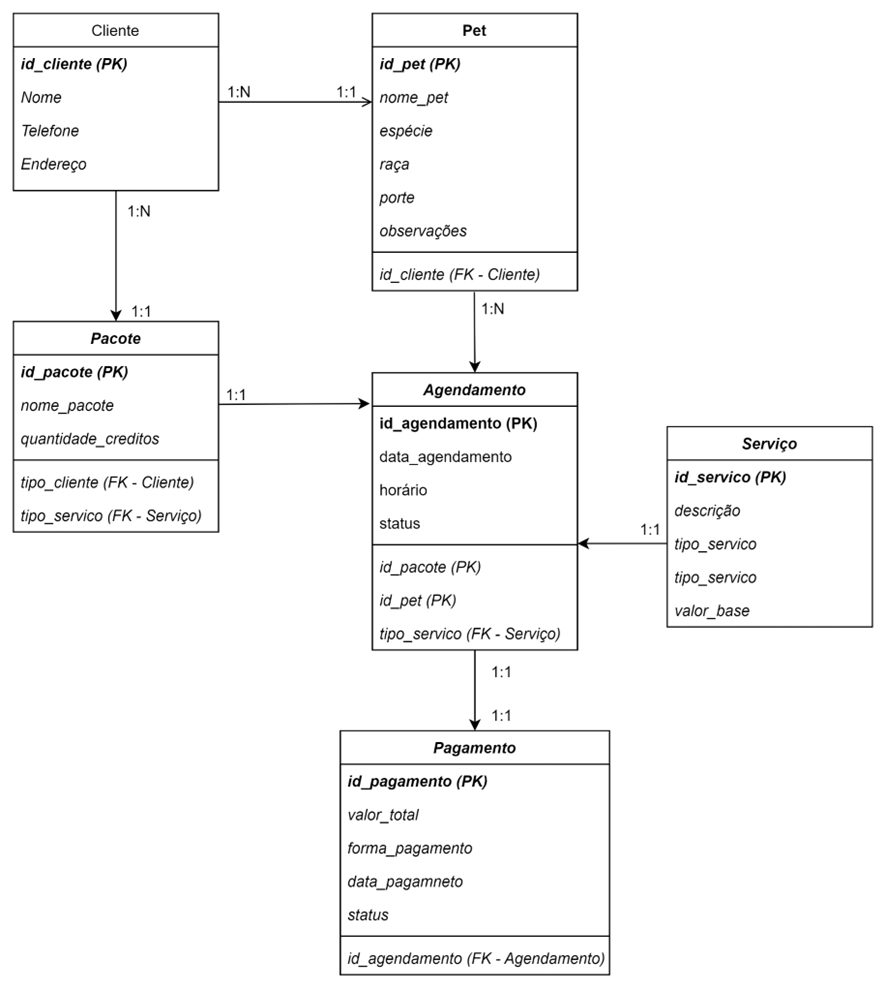

 

#### 3.3.2. Regras de Negócio Principais:
* Cada cliente deve ter pelo menos um pet cadastrado.
* Cada agendamento deve estar vinculado a um pet e a um serviço.
* Pacotes expiram após utilização total de créditos;
* Um pagamento só pode ser registrado para agendamentos concluídos.
* Relatórios são gerados automaticamente a partir da consolidação de dados.

#### 3.3.3. Wireframe do projeto 
**Página: Home**

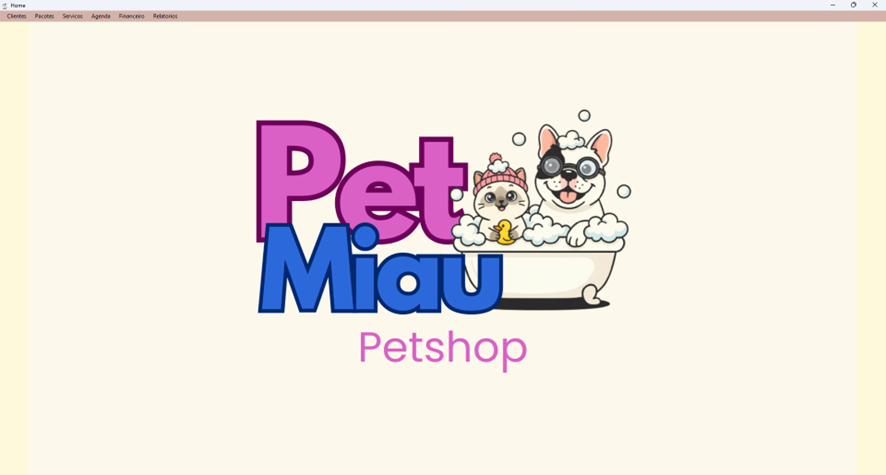

**Página: Gestão de clientes | Dados de clientes**

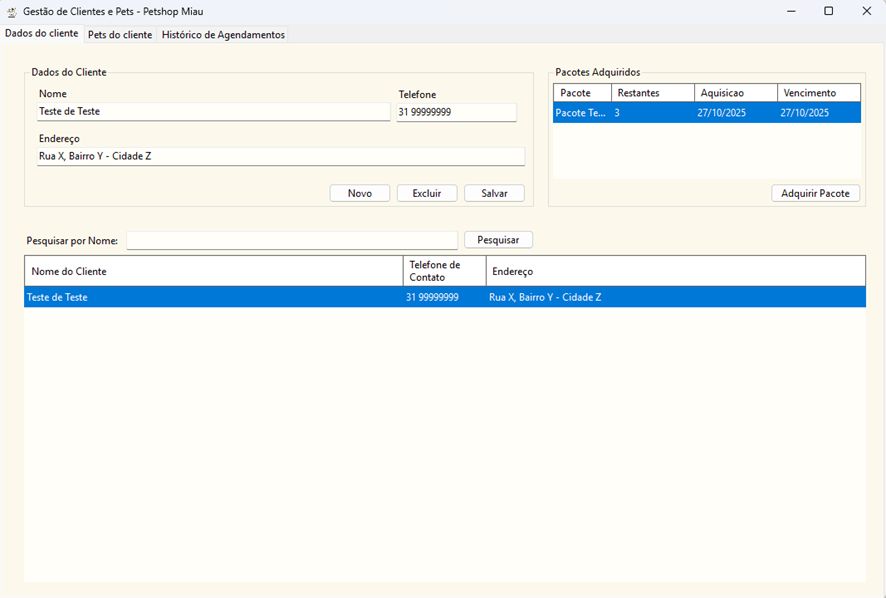

**Página: Gestão de clientes | Dados dos animais dos clientes**

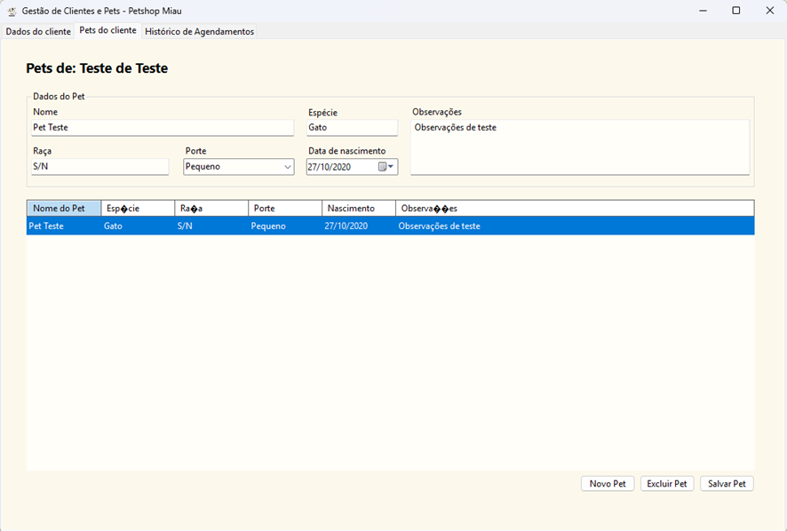

**Página: Gestão de clientes | Histórico de agendamentos**

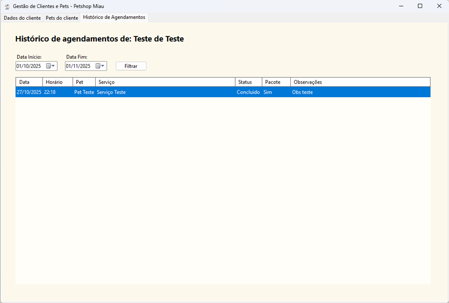

**Página: Gestão de Pacotes | Cadastro**

**Página: Gestão de Serviços | Cadastro**

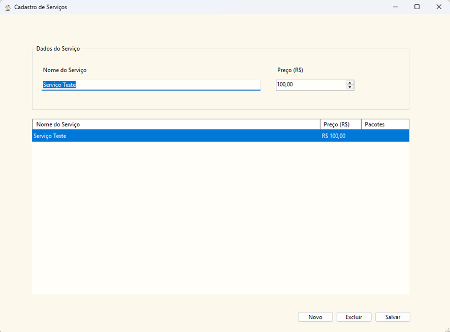

**Página: Gestão de agenda | Cadastro de atendimentos**

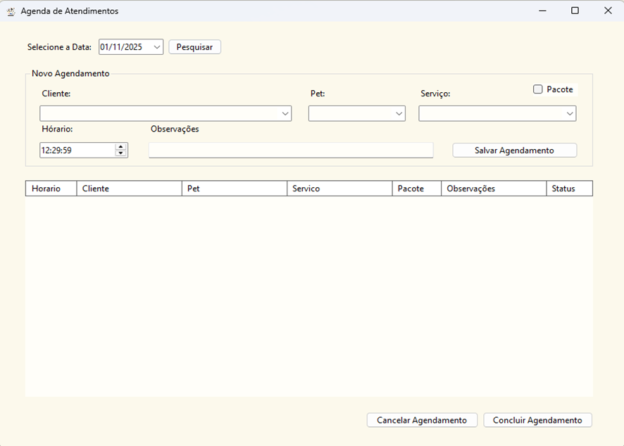

**Página: Gestão do Financeiro | Controle de caixa**

**Página: Gestão de relatórios**

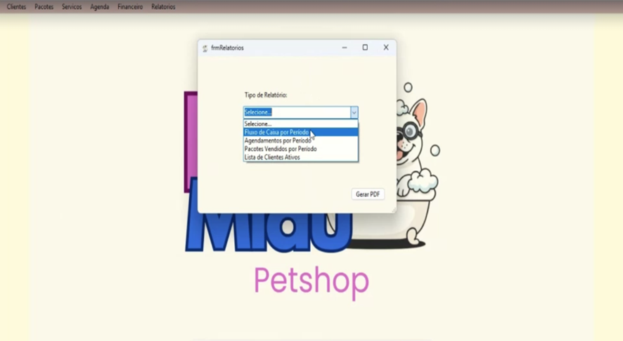
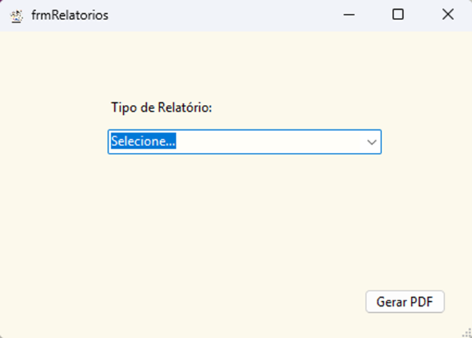

#### 3.3.4. Planejar a estrutura de navegação do sistema; o fluxo de telas, o armazenamento e acesso aos dados.
* **a. Navegação:** Login → Menu principal → Módulos (Agenda, Clientes, Financeiro, Pacotes, Relatórios e Serviços)
* **b. Fluxo de dados:** Usuário → Interface → Banco de dados → Relatórios
* **c. Armazenamento:** Banco de dados local

---
### 3.4. Preparação do Desenvolvimento
#### 3.4.1. Etapas iniciais:
* **a. Desenho da infraestrutura da aplicação, quais são as ferramentas de desenvolvimento e banco de dados, compatíveis para o desenvolvimento da aplicação**
* **b. Criação/ Desenho das telas e dos módulos a serem desenvolvimentos**
* **c. Criação do banco de dados e tabelas principais**
* **d. Implementação do agendamento**
* **e. Módulo financeiro e de relatórios**

#### 3.4.2. Divisão de tarefas:
* **Higor Botelho:** Backend e banco de dados
* **Thalita Farias:** Backend e Frontend
* **Leandro Felipe:** Backend e Frontend
* **Gabriel Henrique:** Backend e Frontend
* **Aline Alves e Alexandre Abreu:** Testes, documentação e tratativas com o cliente do projeto

---
### 3.5. Geração de Relatórios
Os relatórios visam auxiliar nas rotinas diárias do pet shop, como também auxiliar na tomada de decisão estratégica, conforme as necessidades de Inteligência Competitiva levantadas no plano. No Sistema de Informação do Pet Shop Miau teremos os seguintes relatórios:
* Agendamentos por período: diário, semanal ou mensal;
* Fluxo de caixa por período;
* Lista de clientes;
* Pacotes vendidos.
